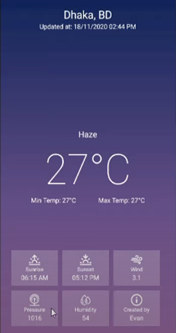

<p align = "center">МИНИСТЕРСТВО НАУКИ И ВЫСШЕГО ОБРАЗОВАНИЯ<br>
РОССИЙСКОЙ ФЕДЕРАЦИИ<br>
ФЕДЕРАЛЬНОЕ ГОСУДАРСТВЕННОЕ БЮДЖЕТНОЕ<br>
ОБРАЗОВАТЕЛЬНОЕ УЧРЕЖДЕНИЕ ВЫСШЕГО ОБРАЗОВАНИЯ<br>
«САХАЛИНСКИЙ ГОСУДАРСТВЕННЫЙ УНИВЕРСИТЕТ»</p>
<br><br><br><br><br><br>
<p align = "center">Институт естественных наук и техносферной безопасности<br>Кафедра информатики<br>Коньков Никита Алексеевич</p>
<br><br><br>
<p align = "center"><br>Лабораторная работа №11. <strong>«Приложение погода»</strong><br>01.03.02 Прикладная математика и информатика</p>
<br><br><br><br><br><br><br><br><br><br><br><br>
<p align = "right">Научный руководитель<br>
Соболев Евгений Игоревич</p>
<br><br><br>
<p align = "center">г. Южно-Сахалинск<br>2022 г.</p>
<br><br><br><br><br><br><br><br><br><br><br><br>

<h1 align = "center">Введение</h1>

<p><b>Android Studio</b> — интегрированная среда разработки (IDE) для работы с платформой Android, анонсированная 16 мая 2013 года на конференции Google I/O. В последней версии Android Studio поддерживается Android 4.1 и выше.</p>
<p><b>Kotlin</b> — это кроссплатформенный статически типизированный язык программирования общего назначения высокого уровня. Kotlin предназначен для полного взаимодействия с Java, а версия стандартной библиотеки Kotlin для JVM зависит от библиотеки классов Java, но вывод типов позволяет сделать ее синтаксис более кратким. Kotlin в основном нацелен на JVM, но также компилируется в JavaScript (например, для интерфейсных веб-приложений, использующих React) или собственный код через LLVM (например, для собственных приложений iOS, разделяющих бизнес-логику с приложениями Android). Затраты на разработку языка несет JetBrains, а Kotlin Foundation защищает торговую марку Kotlin.</p>

<br>
<h1 align = "center">Цели и задачи</h1>


<p>1.Реализовать приложение по макету, материалы для макета в архиве lab11.zip.</p>
<p align = "center"></p>
<p>2. Реализовать с помощью https://openweathermap.org/api, заполнение данными, город назначения выбирайте самостоятельно.</p>


<h1 align = "center">Решение</h1>

<p>В качестве целевого города выбрал Лондон</p>

<h2 align = "center">Файл activity_main.xml</h2>

```xml
<?xml version="1.0" encoding="utf-8"?>
<androidx.constraintlayout.widget.ConstraintLayout xmlns:android="http://schemas.android.com/apk/res/android"
    xmlns:app="http://schemas.android.com/apk/res-auto"
    xmlns:tools="http://schemas.android.com/tools"
    android:layout_width="match_parent"
    android:layout_height="match_parent"
    tools:context=".MainActivity"
    android:background="@drawable/background">

    <androidx.constraintlayout.widget.ConstraintLayout
        android:id="@+id/top_field"
        android:layout_width="match_parent"
        android:layout_height="wrap_content"
        android:layout_marginTop="10dp"
        android:layout_marginLeft="64dp"
        android:layout_marginRight="64dp"
        app:layout_constraintEnd_toEndOf="parent"
        app:layout_constraintStart_toStartOf="parent"
        app:layout_constraintTop_toTopOf="parent">

        <TextView
            android:id="@+id/location"
            android:layout_width="match_parent"
            android:layout_height="wrap_content"
            android:text=""
            android:textColor="@color/white"
            android:textSize="25dp"
            android:textStyle="bold"
            android:textAlignment="center"
            app:layout_constraintEnd_toEndOf="parent"
            app:layout_constraintStart_toStartOf="parent"
            android:fontFamily="sans-serif-light"
            app:layout_constraintTop_toTopOf="parent"/>

        <TextView
            android:id="@+id/update_time"
            android:layout_width="match_parent"
            android:layout_height="wrap_content"
            android:text=""
            android:textColor="@color/white"
            android:textSize="15dp"
            android:textAlignment="center"
            app:layout_constraintEnd_toEndOf="parent"
            app:layout_constraintStart_toStartOf="parent"
            android:fontFamily="sans-serif-light"
            app:layout_constraintTop_toBottomOf="@id/location"/>

    </androidx.constraintlayout.widget.ConstraintLayout>

    <androidx.constraintlayout.widget.ConstraintLayout
        android:id="@+id/weather_field"
        android:layout_width="match_parent"
        android:layout_height="wrap_content"
        android:layout_marginTop="235dp"
        android:layout_marginLeft="32dp"
        android:layout_marginRight="32dp"
        app:layout_constraintEnd_toEndOf="parent"
        app:layout_constraintStart_toStartOf="parent"
        app:layout_constraintTop_toBottomOf="@id/top_field"
        >

        <TextView
            android:id="@+id/weather_forecast"
            android:layout_width="match_parent"
            android:layout_height="wrap_content"
            android:text=""
            android:textColor="@color/white"
            android:textSize="16dp"
            android:textAlignment="center"
            app:layout_constraintEnd_toEndOf="parent"
            android:fontFamily="sans-serif-light"
            app:layout_constraintStart_toStartOf="parent"
            app:layout_constraintTop_toTopOf="parent" />
        <TextView
            android:id="@+id/temp"
            android:layout_width="match_parent"
            android:layout_height="wrap_content"
            android:text=""
            android:textColor="@color/white"
            android:textSize="100dp"
            android:fontFamily="sans-serif-light"
            android:textAlignment="center"
            app:layout_constraintEnd_toEndOf="parent"
            app:layout_constraintStart_toStartOf="parent"
            app:layout_constraintTop_toBottomOf="@id/weather_forecast"/>

        <TextView
            android:id="@+id/temp_min"
            android:layout_width="wrap_content"
            android:layout_height="wrap_content"
            android:text=""
            android:textColor="@color/white"
            android:textSize="12dp"
            android:textAlignment="center"
            android:textStyle="bold"
            android:fontFamily="sans-serif-light"
            app:layout_constraintStart_toStartOf="parent"
            app:layout_constraintEnd_toStartOf="@id/temp_max"
            app:layout_constraintTop_toBottomOf="@id/temp" />

        <TextView
            android:id="@+id/temp_max"
            android:layout_width="wrap_content"
            android:layout_height="wrap_content"
            android:text=""
            android:textColor="@color/white"
            android:textSize="12dp"
            android:textAlignment="center"
            android:textStyle="bold"
            app:layout_constraintEnd_toEndOf="parent"
            android:fontFamily="sans-serif-light"
            app:layout_constraintStart_toEndOf="@id/temp_min"
            app:layout_constraintTop_toBottomOf="@id/temp"  />

    </androidx.constraintlayout.widget.ConstraintLayout>

    <androidx.constraintlayout.widget.ConstraintLayout
        android:id="@+id/statistic_field"
        android:layout_width="match_parent"
        android:layout_height="wrap_content"
        android:layout_marginLeft="16dp"
        android:layout_marginRight="16dp"
        android:layout_marginBottom="16dp"
        app:layout_constraintEnd_toEndOf="parent"
        app:layout_constraintStart_toStartOf="parent"
        app:layout_constraintBottom_toBottomOf="parent"
        >

        <androidx.constraintlayout.widget.ConstraintLayout
            android:id="@+id/sunrise_field"
            android:layout_width="120dp"
            android:layout_height="wrap_content"
            android:background="#35ffffff"
            android:paddingTop="5dp"
            android:paddingBottom="5dp"
            android:layout_marginLeft="32dp"
            app:layout_constraintEnd_toStartOf="@id/sunset_field"
            app:layout_constraintStart_toStartOf="parent"
            app:layout_constraintTop_toTopOf="parent">

            <ImageView
                android:id="@+id/sunrise_image"
                android:layout_width="30dp"
                android:layout_height="30dp"
                app:layout_constraintEnd_toEndOf="parent"
                app:layout_constraintStart_toStartOf="parent"
                app:layout_constraintTop_toTopOf="parent"
                app:srcCompat="@drawable/sunrise" />

            <TextView
                android:id="@+id/sunrise_text"
                android:layout_width="wrap_content"
                android:layout_height="wrap_content"
                android:fontFamily="sans-serif-light"
                android:text="Sunrise"
                android:textAlignment="center"
                android:textColor="@color/white"
                android:textSize="11dp"
                app:layout_constraintEnd_toEndOf="parent"
                app:layout_constraintStart_toStartOf="parent"
                app:layout_constraintTop_toBottomOf="@id/sunrise_image" />

            <TextView
                android:id="@+id/sunrise_time"
                android:layout_width="wrap_content"
                android:layout_height="wrap_content"
                android:fontFamily="sans-serif-light"
                android:text=""
                android:textAlignment="center"
                android:textColor="@color/white"
                android:textSize="14dp"
                app:layout_constraintEnd_toEndOf="parent"
                app:layout_constraintStart_toStartOf="parent"
                app:layout_constraintTop_toBottomOf="@id/sunrise_text" />

        </androidx.constraintlayout.widget.ConstraintLayout>

        <androidx.constraintlayout.widget.ConstraintLayout
            android:id="@+id/sunset_field"
            android:layout_width="120dp"
            android:layout_height="wrap_content"
            android:layout_marginLeft="10dp"
            android:layout_marginRight="10dp"
            android:background="#35ffffff"
            android:paddingTop="5dp"
            android:paddingBottom="5dp"
            app:layout_constraintEnd_toStartOf="@id/wind_field"
            app:layout_constraintStart_toEndOf="@id/sunrise_field"
            app:layout_constraintTop_toTopOf="parent">

            <ImageView
                android:id="@+id/sunset_image"
                android:layout_width="30dp"
                android:layout_height="30dp"
                app:layout_constraintEnd_toEndOf="parent"
                app:layout_constraintStart_toStartOf="parent"
                app:layout_constraintTop_toTopOf="parent"
                app:srcCompat="@drawable/sunset" />

            <TextView
                android:id="@+id/sunset_text"
                android:layout_width="wrap_content"
                android:layout_height="wrap_content"
                android:fontFamily="sans-serif-light"
                android:text="Sunset"
                android:textAlignment="center"
                android:textColor="@color/white"
                android:textSize="11dp"
                app:layout_constraintEnd_toEndOf="parent"
                app:layout_constraintStart_toStartOf="parent"
                app:layout_constraintTop_toBottomOf="@id/sunset_image" />

            <TextView
                android:id="@+id/sunset_time"
                android:layout_width="wrap_content"
                android:layout_height="wrap_content"
                android:fontFamily="sans-serif-light"
                android:text=""
                android:textAlignment="center"
                android:textColor="@color/white"
                android:textSize="14dp"
                app:layout_constraintEnd_toEndOf="parent"
                app:layout_constraintStart_toStartOf="parent"
                app:layout_constraintTop_toBottomOf="@id/sunset_text" />

        </androidx.constraintlayout.widget.ConstraintLayout>

        <androidx.constraintlayout.widget.ConstraintLayout
            android:id="@+id/wind_field"
            android:layout_width="120dp"
            android:layout_height="wrap_content"
            android:background="#35ffffff"
            android:paddingTop="5dp"
            android:paddingBottom="5dp"
            android:layout_marginRight="32dp"
            app:layout_constraintEnd_toEndOf="parent"
            app:layout_constraintStart_toEndOf="@id/sunset_field"
            app:layout_constraintTop_toTopOf="parent">

            <ImageView
                android:id="@+id/wind_image"
                android:layout_width="30dp"
                android:layout_height="30dp"
                app:layout_constraintEnd_toEndOf="parent"
                app:layout_constraintStart_toStartOf="parent"
                app:layout_constraintTop_toTopOf="parent"
                app:srcCompat="@drawable/wind" />

            <TextView
                android:id="@+id/wind_text"
                android:layout_width="wrap_content"
                android:layout_height="wrap_content"
                android:fontFamily="sans-serif-light"
                android:text="Wind"
                android:textAlignment="center"
                android:textColor="@color/white"
                android:textSize="11dp"
                app:layout_constraintEnd_toEndOf="parent"
                app:layout_constraintStart_toStartOf="parent"
                app:layout_constraintTop_toBottomOf="@id/wind_image" />

            <TextView
                android:id="@+id/wind_value"
                android:layout_width="wrap_content"
                android:layout_height="wrap_content"
                android:fontFamily="sans-serif-light"
                android:text=""
                android:textAlignment="center"
                android:textColor="@color/white"
                android:textSize="14dp"
                app:layout_constraintEnd_toEndOf="parent"
                app:layout_constraintStart_toStartOf="parent"
                app:layout_constraintTop_toBottomOf="@id/wind_text" />

        </androidx.constraintlayout.widget.ConstraintLayout>

        <androidx.constraintlayout.widget.ConstraintLayout
            android:id="@+id/pressure_field"
            android:layout_width="120dp"
            android:layout_height="wrap_content"
            android:background="#35ffffff"
            android:paddingTop="5dp"
            android:paddingBottom="5dp"
            android:layout_marginLeft="32dp"
            android:layout_marginTop="10dp"
            app:layout_constraintEnd_toStartOf="@id/humid_field"
            app:layout_constraintStart_toStartOf="parent"
            app:layout_constraintTop_toBottomOf="@id/sunrise_field">

            <ImageView
                android:id="@+id/pressure_image"
                android:layout_width="30dp"
                android:layout_height="30dp"
                app:layout_constraintEnd_toEndOf="parent"
                app:layout_constraintStart_toStartOf="parent"
                app:layout_constraintTop_toTopOf="parent"
                app:srcCompat="@drawable/pressure" />

            <TextView
                android:id="@+id/pressure_text"
                android:layout_width="wrap_content"
                android:layout_height="wrap_content"
                android:fontFamily="sans-serif-light"
                android:text="Pressure"
                android:textAlignment="center"
                android:textColor="@color/white"
                android:textSize="11dp"
                app:layout_constraintEnd_toEndOf="parent"
                app:layout_constraintStart_toStartOf="parent"
                app:layout_constraintTop_toBottomOf="@id/pressure_image" />

            <TextView
                android:id="@+id/pressure_value"
                android:layout_width="wrap_content"
                android:layout_height="wrap_content"
                android:fontFamily="sans-serif-light"
                android:text=""
                android:textAlignment="center"
                android:textColor="@color/white"
                android:textSize="14dp"
                app:layout_constraintEnd_toEndOf="parent"
                app:layout_constraintStart_toStartOf="parent"
                app:layout_constraintTop_toBottomOf="@id/pressure_text" />

        </androidx.constraintlayout.widget.ConstraintLayout>

        <androidx.constraintlayout.widget.ConstraintLayout
            android:id="@+id/humid_field"
            android:layout_width="120dp"
            android:layout_height="wrap_content"
            android:layout_marginLeft="10dp"
            android:layout_marginRight="10dp"
            android:background="#35ffffff"
            android:paddingTop="5dp"
            android:layout_marginTop="10dp"
            android:paddingBottom="5dp"
            app:layout_constraintEnd_toStartOf="@id/created_field"
            app:layout_constraintStart_toEndOf="@id/pressure_field"
            app:layout_constraintTop_toBottomOf="@id/sunset_field">

            <ImageView
                android:id="@+id/humid_image"
                android:layout_width="30dp"
                android:layout_height="30dp"
                app:layout_constraintEnd_toEndOf="parent"
                app:layout_constraintStart_toStartOf="parent"
                app:layout_constraintTop_toTopOf="parent"
                app:srcCompat="@drawable/humidity" />

            <TextView
                android:id="@+id/humid_text"
                android:layout_width="wrap_content"
                android:layout_height="wrap_content"
                android:fontFamily="sans-serif-light"
                android:text="Humidity"
                android:textAlignment="center"
                android:textColor="@color/white"
                android:textSize="11dp"
                app:layout_constraintEnd_toEndOf="parent"
                app:layout_constraintStart_toStartOf="parent"
                app:layout_constraintTop_toBottomOf="@id/humid_image" />

            <TextView
                android:id="@+id/humid_value"
                android:layout_width="60dp"
                android:layout_height="wrap_content"
                android:fontFamily="sans-serif-light"
                android:text=""
                android:textAlignment="center"
                android:textColor="@color/white"
                android:textSize="14dp"
                app:layout_constraintEnd_toEndOf="parent"
                app:layout_constraintStart_toStartOf="parent"
                app:layout_constraintTop_toBottomOf="@id/humid_text" />

        </androidx.constraintlayout.widget.ConstraintLayout>

        <androidx.constraintlayout.widget.ConstraintLayout
            android:id="@+id/created_field"
            android:layout_width="120dp"
            android:layout_height="wrap_content"
            android:background="#35ffffff"
            android:paddingTop="5dp"
            android:layout_marginTop="10dp"
            android:paddingBottom="5dp"
            android:layout_marginRight="32dp"
            app:layout_constraintEnd_toEndOf="parent"
            app:layout_constraintStart_toEndOf="@id/humid_field"
            app:layout_constraintTop_toBottomOf="@id/wind_field">

            <ImageView
                android:id="@+id/created_image"
                android:layout_width="30dp"
                android:layout_height="30dp"
                app:layout_constraintEnd_toEndOf="parent"
                app:layout_constraintStart_toStartOf="parent"
                app:layout_constraintTop_toTopOf="parent"
                app:srcCompat="@drawable/info" />

            <TextView
                android:id="@+id/created_text"
                android:layout_width="wrap_content"
                android:layout_height="wrap_content"
                android:fontFamily="sans-serif-light"
                android:text="Created by"
                android:textAlignment="center"
                android:textColor="@color/white"
                android:textSize="11dp"
                app:layout_constraintEnd_toEndOf="parent"
                app:layout_constraintStart_toStartOf="parent"
                app:layout_constraintTop_toBottomOf="@id/created_image" />

            <TextView
                android:id="@+id/created_user"
                android:layout_width="wrap_content"
                android:layout_height="wrap_content"
                android:fontFamily="sans-serif-light"
                android:text=""
                android:textAlignment="center"
                android:textColor="@color/white"
                android:textSize="14dp"
                app:layout_constraintEnd_toEndOf="parent"
                app:layout_constraintStart_toStartOf="parent"
                app:layout_constraintTop_toBottomOf="@id/created_text" />

        </androidx.constraintlayout.widget.ConstraintLayout>


    </androidx.constraintlayout.widget.ConstraintLayout>


</androidx.constraintlayout.widget.ConstraintLayout>
```


<h2 align = "center">Файл MainActivity.kt</h2>

```kotlin
package com.bignerdranch.android.a23_lab11

import android.graphics.Color
import androidx.appcompat.app.AppCompatActivity
import android.os.Bundle
import android.widget.TextView
import android.os.AsyncTask
import android.widget.ImageView
import org.json.JSONObject
import java.io.BufferedReader
import java.io.InputStreamReader
import java.net.HttpURLConnection
import java.net.URL
import java.text.SimpleDateFormat
import java.util.Date
import java.util.TimeZone

const val apiKey = "24d60fdb1cbedcecdf3e1d08ae743218"
const val cityName = "London"
val userName = "aakihabara"
class MainActivity : AppCompatActivity() {

    private lateinit var weatherField: TextView
    private lateinit var sunriseField: TextView
    private lateinit var sunsetField: TextView
    private lateinit var humidityField: TextView
    private lateinit var tempField: TextView
    private lateinit var pressureField: TextView
    private lateinit var cityCountryField: TextView
    private lateinit var minTempField: TextView
    private lateinit var maxTempField: TextView
    private lateinit var windField: TextView
    private lateinit var updateTime: TextView
    private lateinit var creatorField: TextView
    private lateinit var sunsetImage: ImageView
    private lateinit var sunriseImage: ImageView
    private lateinit var windImage: ImageView
    private lateinit var pressureImage: ImageView
    private lateinit var humidImage: ImageView
    private lateinit var creatorImage: ImageView


    override fun onCreate(savedInstanceState: Bundle?) {
        super.onCreate(savedInstanceState)
        setContentView(R.layout.activity_main)

        val url = "https://api.openweathermap.org/data/2.5/weather?q=$cityName&appid=$apiKey&units=metric"


        weatherField = findViewById(R.id.weather_forecast)
        sunriseField = findViewById(R.id.sunrise_time)
        sunsetField = findViewById(R.id.sunset_time)
        humidityField = findViewById(R.id.humid_value)
        tempField = findViewById(R.id.temp)
        pressureField = findViewById(R.id.pressure_value)
        cityCountryField = findViewById(R.id.location)
        minTempField = findViewById(R.id.temp_min)
        maxTempField = findViewById(R.id.temp_max)
        windField = findViewById(R.id.wind_value)
        updateTime = findViewById(R.id.update_time)
        creatorField = findViewById(R.id.created_user)

        sunsetImage = findViewById(R.id.sunset_image)
        sunsetImage.setColorFilter(Color.WHITE)

        sunriseImage = findViewById(R.id.sunrise_image)
        sunriseImage.setColorFilter(Color.WHITE)

        windImage = findViewById(R.id.wind_image)
        windImage.setColorFilter(Color.WHITE)

        pressureImage = findViewById(R.id.pressure_image)
        pressureImage.setColorFilter(Color.WHITE)

        humidImage = findViewById(R.id.humid_image)
        humidImage.setColorFilter(Color.WHITE)

        creatorImage = findViewById(R.id.created_image)
        creatorImage.setColorFilter(Color.WHITE)

        creatorField.text = userName

        FetchWeatherTask().execute(url)
    }

    private inner class FetchWeatherTask : AsyncTask<String, Void, String>() {

        //Выполнение подлючения не в главном потоке
        override fun doInBackground(vararg params: String): String {
            val url = URL(params[0])
            val connection = url.openConnection() as HttpURLConnection
            try {
                val inputStream = connection.inputStream
                val bufferedReader = BufferedReader(InputStreamReader(inputStream))
                val stringBuilder = StringBuilder()
                var line: String?
                while (bufferedReader.readLine().also { line = it } != null) {
                    stringBuilder.append(line).append("\n")
                }
                bufferedReader.close()
                return stringBuilder.toString()
            } finally {
                connection.disconnect()
            }
        }

        //После успешного подключения начинается выборка данных
        override fun onPostExecute(result: String) {
            val jsonObject = JSONObject(result)
            val temp = jsonObject.getJSONObject("main").getDouble("temp")
            val weather = jsonObject.getJSONArray("weather").getJSONObject(0).getString("main")
            val sunrise = jsonObject.getJSONObject("sys").getLong("sunrise")
            val sunset = jsonObject.getJSONObject("sys").getLong("sunset")
            val humidity = jsonObject.getJSONObject("main").getInt("humidity")
            val pressure = jsonObject.getJSONObject("main").getInt("pressure")
            val city = jsonObject.getString("name")
            val country = jsonObject.getJSONObject("sys").getString("country")
            val minTemperature = jsonObject.getJSONObject("main").getDouble("temp_min")
            val maxTemperature = jsonObject.getJSONObject("main").getDouble("temp_max")
            val windSpeed = jsonObject.getJSONObject("wind").getDouble("speed")
            val dateSunrise = Date(sunrise * 1000)
            val dateSunset = Date(sunset * 1000)
            val timeFormat = SimpleDateFormat("HH:mm a")
            timeFormat.timeZone = TimeZone.getDefault()
            val timeSunriseString = timeFormat.format(dateSunrise)
            val timeSunsetString = timeFormat.format(dateSunset)
            val tempRounded = String.format("%.1f", temp)
            val tempMinRounded = String.format("%.1f", minTemperature)
            val tempMaxRounded = String.format("%.1f", maxTemperature)
            tempField.text = "$tempRounded С\u00B0"
            minTempField.text = "$tempMinRounded С\u00B0"
            maxTempField.text = "$tempMaxRounded С\u00B0"
            weatherField.text = weather
            sunriseField.text = timeSunriseString
            sunsetField.text = timeSunsetString
            humidityField.text = humidity.toString()
            pressureField.text = pressure.toString()
            cityCountryField.text = "$city, $country"
            windField.text = windSpeed.toString()

            val updateTimeFormat = SimpleDateFormat("dd/MM/yyyy hh:mm a")
            val timeNow = updateTimeFormat.format(Date())
            updateTime.text = "Updated at: $timeNow"

        }
    }
}
```


<h1 align = "center">Вывод</h1>
<p>По итогу проделанной лабораторной работы, я познакомился с сервисом Openweathermap и научился с ним работать.</p>
